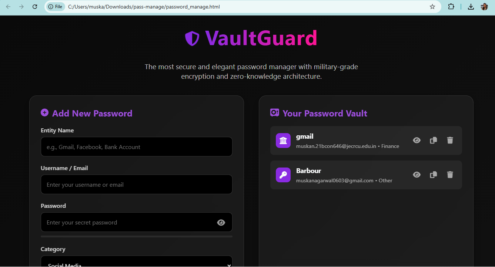

VaultGuard — Secure Password Manager

VaultGuard is a local password management web app that allows users to securely save, manage, and generate passwords directly in their browser — with no server or database involved.
All passwords are stored safely in your browser’s local storage, so your data never leaves your device.

🚀 Features
•	Local Storage Only: No server or cloud required — works completely offline.
•	Add & Save Passwords: Store passwords with details like service name, username/email, category, and notes.
•	Password Generator: Create strong random passwords instantly.
•	Password Strength Meter: Visual feedback on password security level.
•	Show / Hide Password: Toggle visibility for easy viewing.
•	Export & Import Passwords: Backup and restore all passwords in JSON format.
•	Delete & Copy Options: Copy to clipboard or delete with one click.
•	Modern UI: Elegant and responsive design built with HTML, CSS, and JavaScript.

🖥️ How It Works
Open the password_manage.html file in your browser.

•	Fill in the form with:
•	Website/App name
•	Username or Email
•	Password (or generate one)
•	Category and optional notes
•	Click “Save Password”.
•	Your saved passwords appear in the vault on the right side.
•	Use Export to download your passwords as a JSON file.
•	Use Import to restore passwords from a backup.

⚙️ Tech Stack

•	HTML5
•	CSS3 (Custom UI Styling)
•	Vanilla JavaScript (Local Storage Logic)
•	Font Awesome (Icons)

🔐 Data Privacy

•	VaultGuard is designed with privacy in mind:
•	All data is stored locally in your browser (localStorage).
•	No external database or API calls are made.
•	You have full control over your password data.

📦 Installation

•	Download or clone this repository:
•	git clone https://github.com/Agarwal03muskan/pass-manage.git
•	Open the folder:
•	cd pass-manage
•	Launch the app by opening password_manage.html in your browser.

📸 Preview

Here’s how VaultGuard looks in action:

🧠 About the Project
This project was created by Muskan Agarwal to help users like herself store and remember passwords easily without relying on online password managers or cloud servers.
VaultGuard works completely offline and is perfect for personal use.
